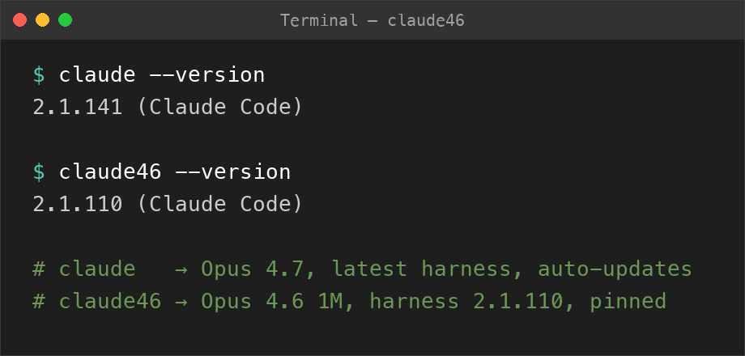

# claude46 — Pin Claude Code to Claude Opus 4.6 (with 1M context)

Install a pinned Claude Code launcher named `claude46` to keep using **Claude Opus 4.6** (`claude-opus-4-6[1m]`) after Claude Code updated its default to Opus 4.7. Your regular `claude` command continues to auto-update normally.



This project is not affiliated with Anthropic. Claude and Claude Code are Anthropic products/trademarks. This repository only provides helper scripts for installing and launching Claude Code.

Published by [Sparkling Neuronics](https://sparklingneuronics.com) · [GitHub](https://github.com/sparklingneuronics)

## Pin Claude Code to Opus 4.6 with `claude46`

`install-claude46.sh` installs a pinned Claude Code launcher named `claude46`.

It is intended for users who want to keep running Claude Opus 4.6 after Opus 4.7 became the default, while leaving the regular `claude` command free to auto-update.

On macOS/Linux, the script installs:

- Claude Code `2.1.110`
- Launcher command: `claude46`
- Default model: `claude-opus-4-6[1m]`
- Binary path: `~/.local/share/claude46/claude-2.1.110`
- Launcher path: `~/.local/bin/claude46`

(Native Windows install layout is described in the [Windows](#windows) section.)

The launcher sets `DISABLE_AUTOUPDATER=1` and `DISABLE_UPDATES=1`, so `claude46` stays pinned (background auto-updates blocked, and an explicit `claude46 update` is a no-op). Your normal `claude` command is not modified.

## Install claude46 to Keep Using Claude Opus 4.6

Run the stable installer directly from GitHub:

```bash
curl -fsSL https://raw.githubusercontent.com/sparklingneuronics/claude-code-helpers/v0.1.0/install-claude46.sh | bash
```

If you prefer to inspect the script before running it:

```bash
curl -fsSL https://raw.githubusercontent.com/sparklingneuronics/claude-code-helpers/v0.1.0/install-claude46.sh -o install-claude46.sh
less install-claude46.sh
bash install-claude46.sh
```

To run the latest version from `main` instead:

```bash
curl -fsSL https://raw.githubusercontent.com/sparklingneuronics/claude-code-helpers/main/install-claude46.sh | bash
```

## Local Install

From this repository:

```bash
chmod +x install-claude46.sh
./install-claude46.sh
```

If `~/.local/bin` was not already on your `PATH`, open a new terminal after installation or run:

```bash
export PATH="$HOME/.local/bin:$PATH"
```

The installer appends that `export PATH=...` line to `~/.zshrc` only. If your shell is bash (common on Linux), add the same line to `~/.bashrc` or `~/.bash_profile` yourself.

## Use

Start the pinned Claude Code launcher:

```bash
claude46
```

Check the installed version:

```bash
claude46 --version
```

Your regular Claude Code installation remains available separately:

```bash
claude
```

## Default Model: `claude-opus-4-6[1m]` (override per run)

`claude46` defaults to `claude-opus-4-6[1m]`.

For a single run, pass a different model:

```bash
claude46 --model sonnet
claude46 --model claude-opus-4-6
```

CLI arguments take precedence over the default model set by the wrapper.

## Reinstall

Run the installer again:

```bash
./install-claude46.sh
```

This replaces the pinned binary and launcher at the same paths.

## Uninstall

Remove the pinned binary and launcher.

macOS / Linux / WSL:

```bash
rm -f "$HOME/.local/bin/claude46"
rm -rf "$HOME/.local/share/claude46"
```

Optionally remove this line from `~/.zshrc` if you no longer need it:

```bash
export PATH="$HOME/.local/bin:$PATH"
```

Native Windows:

```powershell
Remove-Item -Recurse -Force "$env:LOCALAPPDATA\claude46"
```

Optionally remove `%LOCALAPPDATA%\claude46\bin` from your user PATH via System Properties → Environment Variables.

## Requirements

- macOS or Linux (including WSL)
- `curl`
- `bash`
- `~/.local/bin` on your `PATH`

For native Windows, see [Windows](#windows) below.

## Windows

`install-claude46.sh` does not run on native Windows. Use one of these paths:

### Inside WSL (recommended)

Open a WSL shell and follow the bash install steps in [Install](#install-claude46-to-keep-using-claude-opus-46) / [Local Install](#local-install) above. The bash script identifies WSL as Linux, and `claude46` will be available from your WSL terminals.

### Native Windows: `install-claude46.ps1`

The PowerShell installer pins `@anthropic-ai/claude-code@2.1.110` via npm into an isolated prefix at `%LOCALAPPDATA%\claude46\`, writes a `claude46.cmd` wrapper that sets `DISABLE_AUTOUPDATER=1`, `DISABLE_UPDATES=1`, and `ANTHROPIC_MODEL=claude-opus-4-6[1m]`, and adds `%LOCALAPPDATA%\claude46\bin` to your user PATH. No admin rights needed. Your global `claude` (if any) is untouched.

Prerequisites:

- Node.js 18+ and npm
- Git for Windows (Claude Code requires Git Bash on native Windows; set `CLAUDE_CODE_GIT_BASH_PATH` if Git is installed in a nonstandard location)

Quick install from PowerShell:

```powershell
irm https://raw.githubusercontent.com/sparklingneuronics/claude-code-helpers/v0.2.0/install-claude46.ps1 | iex
```

Or from `cmd.exe`:

```cmd
powershell -NoProfile -ExecutionPolicy Bypass -Command "irm https://raw.githubusercontent.com/sparklingneuronics/claude-code-helpers/v0.2.0/install-claude46.ps1 | iex"
```

To run the latest from `main` instead, replace `v0.2.0` with `main` in the URL.

Local install from a cloned repo:

```cmd
install-claude46.cmd
```

Open a new terminal after install, then run `claude46`.

### Without installing (ad-hoc via npx)

For a one-off pinned Opus 4.6 session without installing anything globally, from PowerShell:

```powershell
$env:DISABLE_AUTOUPDATER="1"
$env:DISABLE_UPDATES="1"
$env:ANTHROPIC_MODEL="claude-opus-4-6[1m]"
npx --yes --package=@anthropic-ai/claude-code@2.1.110 claude
```

From `cmd.exe`:

```cmd
set "DISABLE_AUTOUPDATER=1"
set "DISABLE_UPDATES=1"
set "ANTHROPIC_MODEL=claude-opus-4-6[1m]"
npx --yes --package=@anthropic-ai/claude-code@2.1.110 claude
```

## FAQ

### How do I keep using Claude Opus 4.6 after Claude Code updated to Opus 4.7?

Install the `claude46` launcher from this repo and run `claude46` instead of `claude`. It installs Claude Code `2.1.110` and defaults the model to `claude-opus-4-6[1m]`.

### How do I downgrade Claude Code to Opus 4.6?

You don't have to downgrade your main install. `claude46` is a separate pinned binary at version 2.1.110 with auto-update disabled, installed alongside your normal `claude` command.

### Does this support the Opus 4.6 1M context window?

The launcher sets the default model ID to `claude-opus-4-6[1m]`, which requests the 1M context variant. Whether your account actually gets the 1M window depends on your Anthropic plan/tier.

### Will this break my normal `claude` install?

No. `claude46` does not replace your normal `claude` binary — they live at different paths, `claude` keeps updating, and `claude46` stays pinned. They do share Claude Code's per-user auth/config directory (`~/.claude/` on macOS/Linux/WSL, `%USERPROFILE%\.claude\` on native Windows), so logging in for one logs in for both.

### How do I switch back to the latest Claude Code?

Just run `claude` as usual, or follow the commands in the [Uninstall](#uninstall) section for your platform.

## Maintenance

This repository is shared as a small personal helper. Issues and pull requests may not be reviewed, and no maintenance, compatibility, or support commitment is implied.

## License

This repository is licensed under the MIT License. The license applies only to the scripts and documentation in this repository. It does not apply to Claude Code or any Anthropic software downloaded by the helper script.
